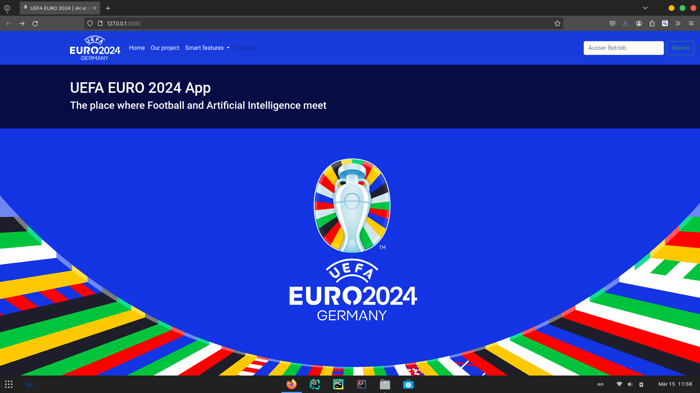
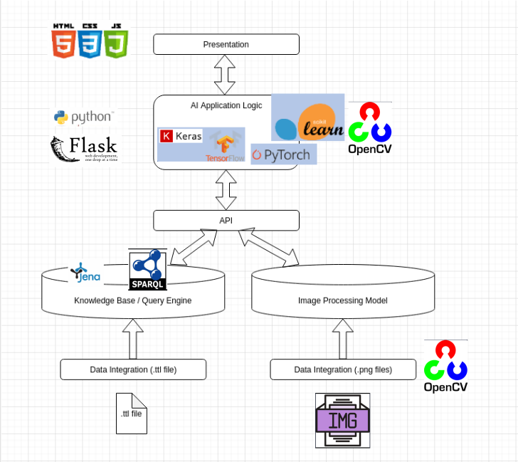
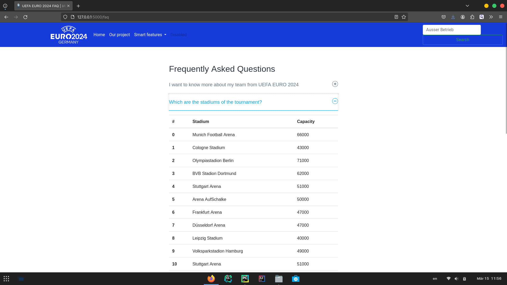
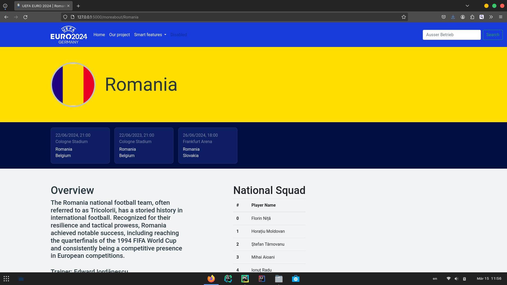
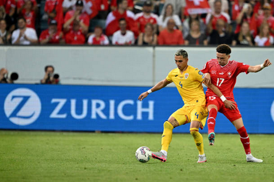

# UEFA EURO 2024 - into AI World

## Description
A project that combines Knowledge Graphs Representation, Machine Learning and Computer Vision
into the topic of football.

## Architecture

**Backend**: 
- Python and Flask framework
- OpenCV
- TensorFlow Keras
- Apache Jena Fuseki - for hosting the [Knowledge Graph](./Knowledge_Graph_Task/Euro2024_DB.ttl)
- SparQL: language for interacting with the Knowledge Graph

**Frontend**:
- HTML
- CSS (and sometimes Bootstrap)
- JavaScript

## Functional requirements:
    Create a knowledge graph with all the teams of EURO2024;
    - matches to be played, info about venues and about squads will be also known.
    
    Make a presentation page with Venues.
    

    Make presentation pages containing information about National Teams.

    Develop a feature that takes as input a picture of two players and can predict 
    the team which they are part of.
    
For the last requirement OpenCV was used to allow the user to manually drag the bounding-boxes.

## Execution
In order to start the program, you need to start [Apache Jena Fuseki Server](./apache-jena-fuseki-4.10.0/fuseki-server).  
Inside Fuseki you need to load the [Knowledge Graph](./Knowledge_Graph_Task/Euro2024_DB.ttl).

Then run [app.py](./server/app.py) and launch the given localhost url.

## Special Thanks
The project was done under the coordination of [Prof. Florian Heinrichs](https://hessian.ai/de/personen/florian-heinrichs/) of 
Hochschule Darmstadt of Applied Sciences, Germany.

Also, I couldn't pull this project off without the valuable help of my colleagues:
- Ly Nguyen
- Jan Schmalfuß
- Ben Hamouda

    